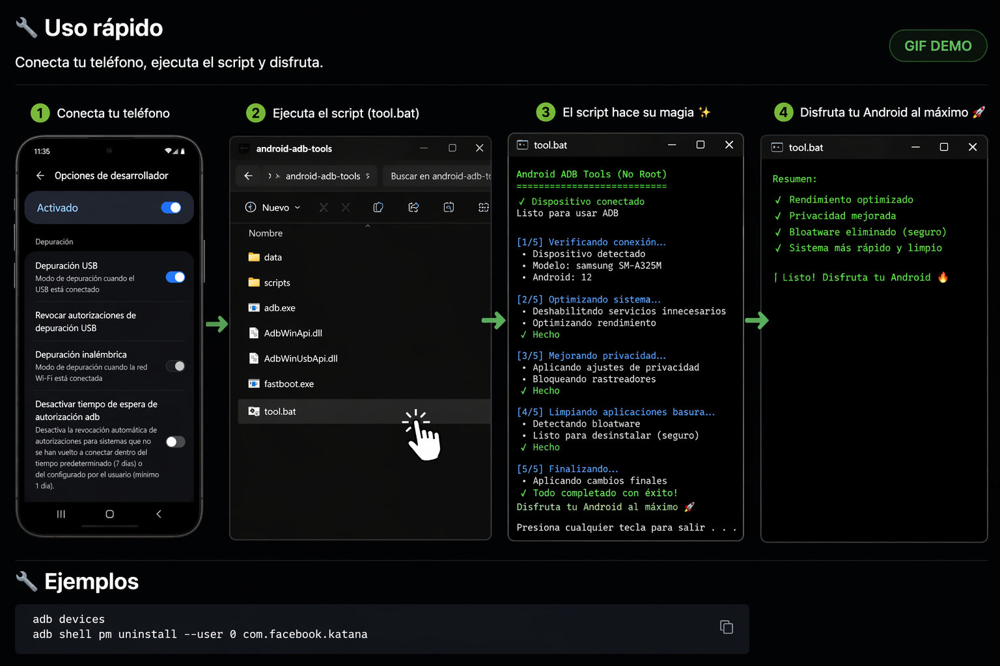

# 🚀 Android ADB Tools (No Root)

Boost your Android performance using simple ADB scripts.

## 🎬 Demo (How it works)

<p align="center">
  
</p>


---

## ✅ Features

- 🧹 Remove bloatware safely  
- ⚡ Improve performance  
- 🔒 Enhance privacy  

---

## 📦 Download

👉 [Download Latest Version](../../releases/latest)

---

## 🧰 Requisitos

- PC
- ADB instalado
- Depuración USB activada

---

## ⚙️ Instalación

1. Descarga el archivo `.zip`
2. Extrae el contenido
3. Asegúrate de tener ADB instalado
4. Activa "Depuración USB" en tu Android

---

## ⚡ Uso rápido

1. Conecta tu teléfono  
2. Ejecuta el script (`tool.bat`)  
3. Disfruta  

---

## 🔧 Ejemplos

```bash
adb devices
adb shell pm uninstall --user 0 com.facebook.katana
```

---

## ⚠️ Disclaimer

Use at your own risk.  
Some commands may remove system apps and affect device stability.
